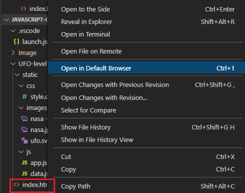
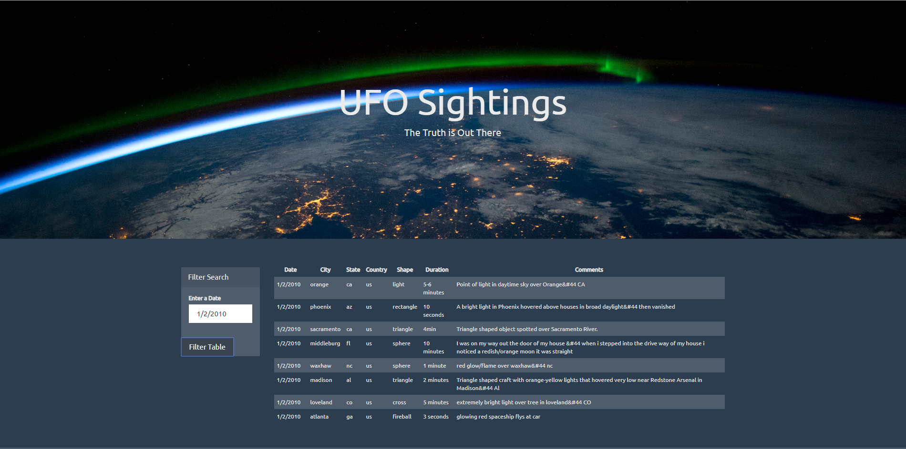
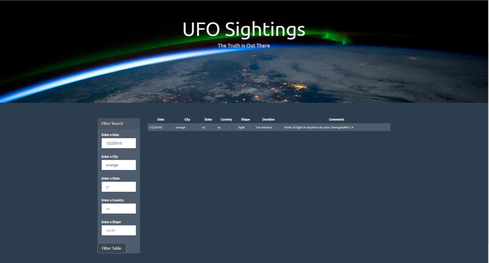

# javascript-challenge
## Homework for JavaScript
##

    
  

  
### Objectives:
Create a table dynamically using dataset provided. Data are vizualized in a webpage

#### Languages
 - pure JavaScript
 - HTML
 - CSS
 - D3.js 

#### How to open the webpage
 Right-click on "index.html", then open the file in "Default Browser". 

    
  

#### Level1
Data are filter using the date. Users enter the target date in input box. 
An example is shown below for "1/2/2010": 

    
  

  
  
#### Level2
Data are filter using date, city, state, country and shape. Similarly to level 1, users enter the filter values in input boxes. 
An example is shown below for {date: "1/2/2010" && city:"orange"} : 

    
  
